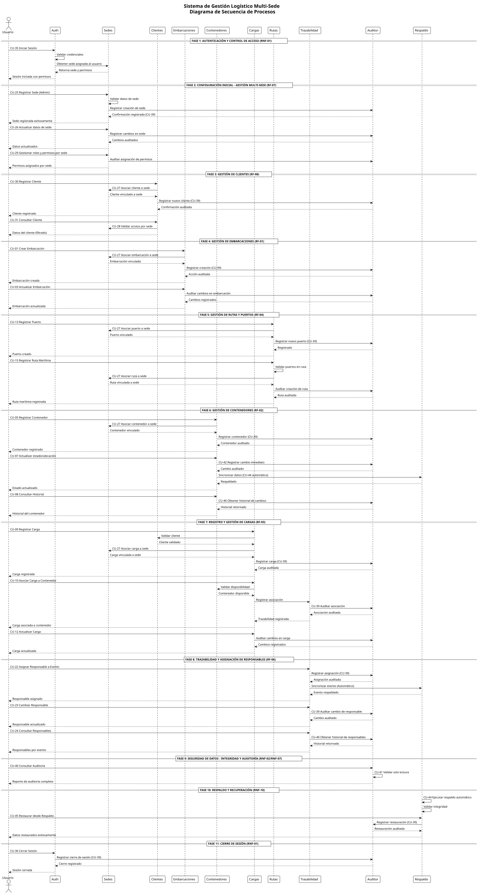
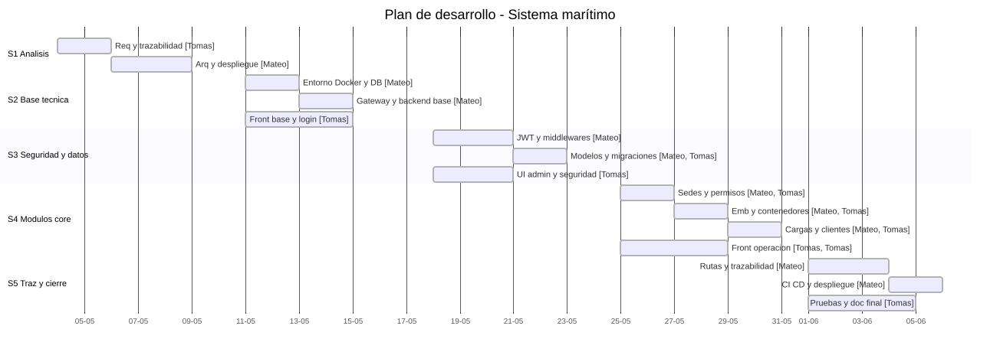

# Docker-is-Able — Documentación Técnica Consolidada

Fecha: 2026-05-21

Resumen
-------
FISProject es una plataforma integral para la gestión logística marítima multi-sede. Está compuesta por:

- Frontend Angular (UI administrativa y operativa)
- Gateway (FastAPI) que centraliza autenticación, autorización, rate limiting, auditoría y proxificación de API
- Backend Core (FastAPI) que expone los recursos de dominio bajo `/api/v1`
- Persistencia: PostgreSQL (seguridad y datos de negocio)
- Caché y coordinación operativa: Redis (blacklist, rate limiting, cache)

Este documento consolida toda la documentación disponible en el directorio `documentation/`, organiza la información por carpetas y añade descripciones y recomendaciones operacionales.

Índice
------
- **Resumen**
- **Arquitectura general**
- **Secciones por carpeta**
  - `architecture/`
  - `components/`
  - `context/`
  - `prompts/`
  - `schedule/`
  - `testcases/`
  - `tests/`
  - `User Stories/`
- **Mapa de API y contratos**
- **Configuración y snippets críticos**
- **Pruebas y resultados**
- **Planificación y Gantt**
- **Recomendaciones y próximos pasos**
- **Anexos y lista de archivos**

Arquitectura general
--------------------

Topología y responsabilidades:

- Zona pública: frontends y clientes (navegadores). El frontend Angular comunica por HTTPS con el Gateway.
- DMZ / Gateway (puerto 8080): punto de control central — autenticación, autorización (RBAC), rate limiting, cabeceras de seguridad y proxy hacia el backend core.
- Zona interna: backend core (puerto 8000) con servicios de negocio y lógica del dominio.
- Datastores: PostgreSQL (seguridad y dominio) y Redis (blacklist, rate limit, caches).

Consideraciones importantes:

- Mantener separado el modelo de seguridad del Gateway del modelo de dominio del backend core.
- Redis es componente crítico para la operación segura (si Redis falla, habilitar degradación segura y alertas).
- Evitar redirecciones 307 debidas a mismatched trailing slashes: respetar la definición del backend (`/vessels/` vs `/vessels`).

Secciones por carpeta (documentación detallada)
-------------------------------------------

1) `architecture/`

- Contenido clave:
  - `frontend_independiente_blueprint.md`: blueprint técnico para un frontend ERP independiente con su propio flujo de autenticación y almacenamiento de tokens. Describe alcance funcional, supuestos de integración y un mapa detallado de las APIs que debe consumir.
  - `network_architecture.puml`: PlantUML del diseño de red, zonas (Internet, DMZ, Internal, Cloud) y límites de comunicación.

Resumen de `frontend_independiente_blueprint.md`:

- Propone dos esquemas de integración: login contra el gateway (recomendado actualmente) o un auth service dedicado en el futuro.
- Define estructura del frontend (módulos y rutas) y componentes sugeridos para cada entidad (CRUD común y widgets compartidos como `HealthStatusWidgetComponent`).

Artefactos visuales:

- Diagrama de red (PlantUML): `architecture/network_architecture.puml` (ver archivo fuente).

2) `components/`

- Contenido: `componentes_completo.puml` — diagrama de componentes que engloba Frontend, Gateway, Backend, Data Stores y artefactos DevOps.

Descripción:

- Define responsabilidades de cada componente (por ejemplo: `GatewayService` en frontend, routers `auth.py`, `proxy.py` en gateway, `vessels`/`containers`/`cargo` en backend).
- Relaciona artefactos de despliegue (`docker-compose`, `Alembic`, scripts) con los componentes que utilizan esos artefactos.

3) `context/`

- Contenido principal: `secuenciaProcesos.puml` (diagrama de secuencia de procesos) y `DiagramaProcesos.svg` (renderizado SVG disponible).

Descripción práctica:

- El diagrama de secuencia documenta flujos completos: autenticación, creación de sedes, registro de clientes, registro y actualización de embarcaciones y contenedores, registro de eventos de trazabilidad, auditoría y respaldo.
- Este artefacto es la referencia operativa para diseñar APIs y validar orden de operaciones transaccionales.

Diagrama (renderizado):

4) `prompts/`

- Contiene extractos y bloques de código usados para pruebas unitarias y snippets de configuración para tests (`unit_tests_code_blocks.txt`) y un archivo `unit tests.txt` (vacío).

Uso:

- `unit_tests_code_blocks.txt` ofrece código de ejemplo para los componentes críticos (`config.py`, `database.py`, `security.py`) que sirven tanto en pruebas unitarias como en revisión de diseño.

5) `schedule/`

- Contenido: `schedule-gantt.mmd` y `gantt-schedule.svg` (renderizado SVG disponible).

Descripción:

- Cronograma del proyecto con fases (Análisis, Base técnica, Seguridad y datos, Módulos core, Trazabilidad y cierre) y responsables por tarea.

Diagrama del cronograma:

6) `testcases/`

- Contenido: numerosos `.puml` que modelan casos de uso por requerimiento y diagramas específicos (`AsignacionResponsables.puml`, `TrazabilidadEnvio.puml`, `SeguridadYControldeAcceso.puml`, `GestionMultisede.puml`, etc.), además de `conceptualidad.txt` con actores y lista de casos de uso principales.

Propósito:

- Cada PlantUML en `testcases/` está dirigido a documentar reglas de negocio y procesos que deben cubrirse en pruebas funcionales e integradas.

7) `tests/`

- Subcarpetas: `unit-Tests`, `security`, `performance`, `deployment`, `CI` con informes `.md` y versiones en PDF.

Resumen de resultados (síntesis):

- Unit tests: cobertura ~87%, 52 pruebas ejecutadas (47 pasadas, 5 fallidas) — enfocarse en casos límite detectados por los tests fallidos.
- Security: cumplimiento ~91% con hallazgos a resolver en gestión de secretos y endurecimiento de pipeline.
- Performance: endpoints proxificados presentan mayor latencia; recomendaciones para caching y optimización gateway→backend.
- Deployment: tasa de éxito ~83%, con recomendaciones para sincronización de arranque y espera de dependencias (DB/Redis).

8) `User Stories/`

- Contenido: `Historias de usuario.md` (versión completa con criterios de aceptación). Cubre funcionalidad de seguridad, multi-sede, embarcaciones, contenedores, carga, rutas, trazabilidad y operaciones transversales (respaldo, auditoría, rendimiento en tiempo real).

Mapa de API y contratos (extracto técnico)
---------------------------------------

El backend core expone todos los recursos operativos bajo `/api/v1`. A continuación una referencia técnica rápida (no exhaustiva):

- Health
  - `GET /api/v1/health` — estado y metadatos del servicio
  - `GET /api/v1/ready` — readiness, dependencias

- Vessels, Containers, Cargo, Clients, Ports, Routes, Shipments, Events, Locations, Personnel, Contracts — operaciones CRUD completas, con endpoints auxiliares para búsquedas por código o número.

Gateway (endpoints de gestión y autenticación):

- `POST /auth/login`, `POST /auth/refresh`, `POST /auth/logout`, `GET /auth/me`
- `/admin/*` para estadísticas, usuarios, auditoría y métricas

Notas operativas:

- Respetar trailing slashes en llamadas a recursos para evitar que el gateway genere redirecciones 307.
- Usar los endpoints `/health` y `/ready` para orchestration y monitorización.

Configuración y snippets críticos
--------------------------------

Extractos relevantes (referencia técnica):

- `config.py` (Settings): variables de entorno, URLs de backend y Redis, claves secretas y parámetros de rate limiting.
- `database.py`: motor SQLAlchemy y patrón `get_db()` para dependencias.
- `security.py`: funciones de hashing (Argon2), JWT, blacklist en Redis y cifrado (Fernet).

Pruebas y resultados (resumen técnico)
------------------------------------

- Unit tests: cubrir las utilidades críticas (config parsing, DB session lifecycle, seguridad y blacklist). Mejorar los escenarios que fallaron en mocks de Redis y validaciones de configuración.
- Security: atender hallazgos relacionados a secretos por defecto y endurecer pipeline. Considerar hacer los escaneos bloqueantes.
- Performance: optimizar gateway para reducir overhead en rutas proxificadas; introducir cache y revisar consultas intensivas en el backend.
- Deployment: robustecer scripts para esperar readiness de PostgreSQL y Redis antes de iniciar servicios críticos.

Planificación y artefactos visuales
----------------------------------

- Ver `schedule/schedule-gantt.mmd` y `gantt-schedule.svg` para la planificación temporal.
- Ver `components/componentes_completo.puml` y `architecture/network_architecture.puml` para entender dependencias y límites de confianza.

Recomendaciones y próximos pasos técnicos
----------------------------------------

1. Alta prioridad: diseñar y aplicar redundancia para Redis o un fallback, y añadir alertas en monitoring.
2. Medio plazo: introducir caching en el gateway para endpoints de lectura intensiva y revisar políticas de expiración.
3. CI/CD: configurar quality gates para seguridad y cobertura mínima de tests unitarios en PRs.
4. Operaciones: automatizar checks `ready` y aplicar backoff/retry para conexiones externas (Cloud DB).

